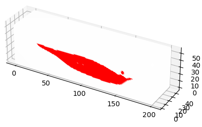
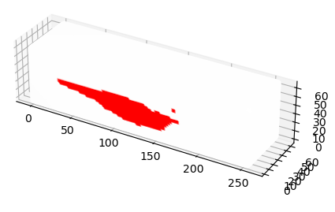

# 🔥 3D-GAN 기반 용접 용융지 형상 예측

이 프로젝트는 **Generative Adversarial Network (GAN)** 을 활용하여  
**용접 각도에 따른 용융지(molten pool) 형상**을 3차원으로 예측하는 모델입니다.

---

## 📖 프로젝트 개요
- **목표**: 용접 조건(예: 용접 각도)에 따른 3D 용융지 형상 예측  
- **모델 구조**: PyTorch 기반 3D-GAN  
- **입력**: 용접 조건(각도 등) + 형상 벡터  
- **출력**: 3D voxel 형태의 용융지 형상  

---

## ⚙️ 주요 기능
- **Generator**: 조건(각도)에 따라 3D 용융지 형상 생성  
- **Discriminator**: 실제 데이터와 생성된 데이터를 판별  
- **조건부 GAN (Conditional GAN)**: 용접 각도를 원-핫 인코딩하여 입력에 결합  
- **시각화**: 예측된 용융지 형상을 3D voxel grid로 시각화  

---

## 📊 결과
- 실제 데이터 형상

- 생성 데이터 형상

---