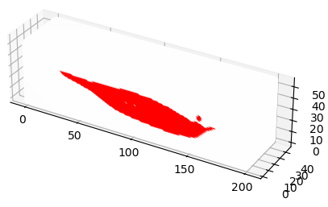
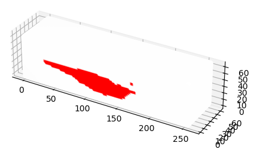
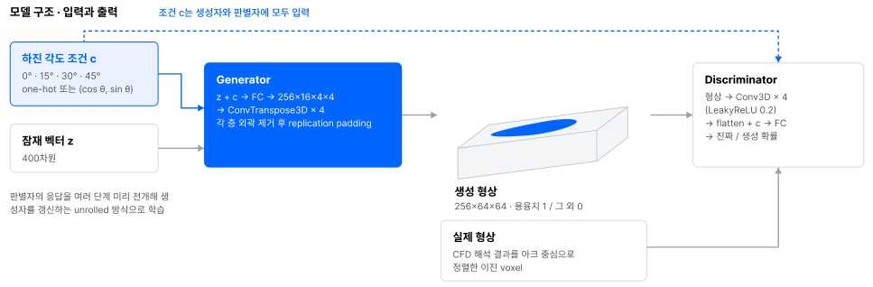
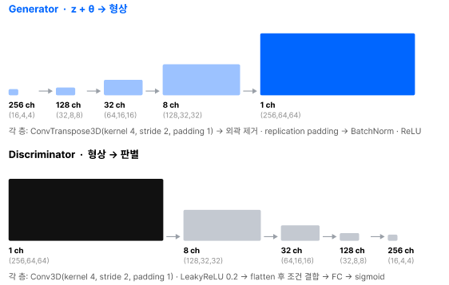
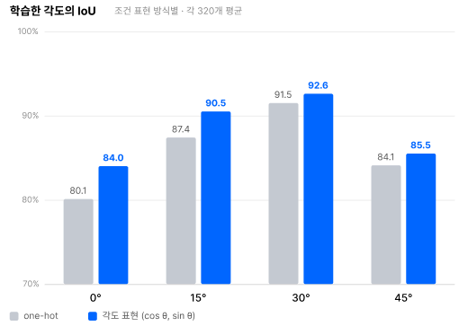
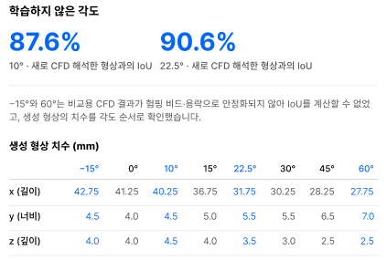

<table>
  <tr>
    <td align="center"> 실제 형상 (CFD 해석 결과)</td>
    <td align="center"> 생성 형상</td>
  </tr>
</table>

### 용융풀 3D 형상 조건부 생성 모델

> **연구 기간**: 2025. 04 ~ 2025. 06 
> **형태**: 공동 연구 
> **역할**: 딥러닝 아키텍처 구현 · 학습 · 평가
>
> 용접 **하진 각도를 조건**으로 받아 용융풀의 **3D voxel 형상을 생성**하는 
> **조건부 3D-GAN** (PyTorch · Unrolled GAN)

| 성과 | 내용 |
|:---:|---|
| 📊 **학습한 각도 IoU** | 0° **84.0%** · 15° **90.5%** · 30° **92.6%** · 45° **85.5%** (각도 표현 조건, 각 320개 평균) |
| 🎯 **학습하지 않은 각도 IoU** | 10° **87.6%** · 22.5° **90.6%** (새로 CFD 해석한 형상과 비교) |

---

## 목차

- [소개](#intro)
- [모델 구조](#model)
- [평가](#evaluation)
- [기술 스택](#tech-stack)

---

## 소개

용접 열원 해석에 쓰는 용융풀 형상은 조건이 바뀔 때마다 CFD 해석을 새로 돌려 얻어야 합니다.
이 프로젝트는 **하진 각도를 조건으로 넣으면 용융풀 3D 형상을 바로 생성**하는 모델을 만드는 연구이며, 그중 딥러닝 아키텍처 구현과 학습, 평가를 맡았습니다.

- **데이터**: CFD 해석 결과(하진 각도 0° · 15° · 30° · 45°)를 응고 경계 기준으로 이진화한 **256 × 64 × 64 voxel**
- **조건 표현**: 각도를 one-hot 또는 **(cos θ, sin θ)** 로 표현해 두 방식을 같은 조건에서 비교
- **학습 안정화**: 판별자를 여러 단계 미리 전개한 뒤 생성자를 갱신하는 **Unrolled GAN** 방식 적용

---

## 모델 구조

- 잠재 벡터 z(400차원)와 각도 조건 c를 결합해 생성자에 입력하고, 같은 조건을 판별자에도 함께 입력
- 실제 형상은 CFD 해석 결과를 아크 중심으로 정렬한 이진 voxel

- **Generator**: FC로 256 × 16 × 4 × 4 블록을 만든 뒤 3D 전치 합성곱 4단계로 256 × 64 × 64까지 복원
- **Discriminator**: 3D 합성곱 4단계로 압축한 특징에 조건을 결합해 진짜 · 생성 확률 출력
- **외곽 제거 후 replication padding**: 사용한 프레임워크의 ConvTranspose3D가 replication padding을 직접 지원하지 않아, 각 층 출력의 외곽을 제거한 뒤 replication padding을 따로 적용

---

## 평가

생성 결과에서 가장 큰 연결 덩어리만 남겨 노이즈를 제거한 뒤, CFD로 얻은 실제 형상과 **voxel 단위 IoU**를 계산했습니다.

<table>
  <tr>
    <td align="center" valign="top"></td>
    <td align="center" valign="top"></td>
  </tr>
</table>

- 학습한 네 각도 모두에서 **(cos θ, sin θ) 표현이 one-hot보다 IoU가 높음**
- 학습하지 않은 10° · 22.5°도 새로 CFD 해석한 형상과 비교해 IoU **87.6% · 90.6%**
- −15° · 60°는 비교용 CFD 결과가 험핑 비드 · 용락으로 안정화되지 않아 IoU 대신 생성 형상의 치수가 각도 순서를 따르는지 확인

---

## 기술 스택

| 분류 | 기술 |
|---|---|
| **Language** |  |
| **Deep Learning** |  |
| **Data · 시각화** |   |
| **후처리** |  |
